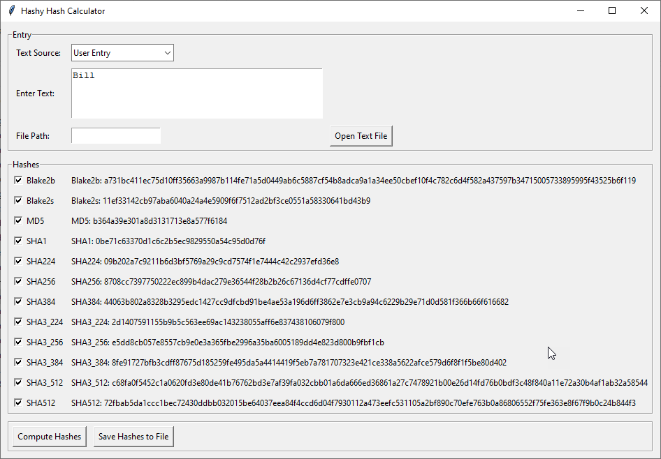

# CryptoDemon

Python Cryptography Demonstration Program

### Requirements
- [PyCryptodome](https://pypi.org/project/pycryptodome) is a self-contained Python package of low-level cryptographic primitives.

```pip install pycryptodome```

### Cryptography Modules and Hashy
- (10/02/2023) **hashy_gui_2.py** is a Python Tkinter that takes user input or a text file, displays several hash algorhythm results.
- (10/02/2023) **des3_class.py** uses 3DES to encrypt and decrypt data with or without a user input shared key
- (09/28/2023) **des3_class_shared_key.py** uses 3DES to encrypt and decrypt incoming plain text with user shared key
- (09/28/2023) **des3_generated_key.py** uses 3DES to encrypt and decrypt incoming plain text with random key

### DES Encryption

The Data Encryption Standard (DES) is a symmetric-key block cipher. DES is significant as one of the earliest widely adopted encryption standards. It was first published in 1975 and became a federal standard in the United States. Its 56-bit key length makes it vulnerable to brute-force attacks. NIST deprecated its use in 2018.

DES uses a 56 bit key. The initial key consists of 64 bits (8 bytes). Before the DES process even starts, every 8th bit of the key is discarded to produce a 56-bit key. DES uses an 8 byte block cipher. Data is encrypted 64 bits (8 bytes) at a time and must be padded to increments of 8 bytes.

### 3DES Encryption

Triple Data Encryption Standard (3DES) is a symmetric-key block cipher used in information security and cryptography. It was published in 1999 to replace DES. NIST deprecated its use in 2023.

It operates on 64-bit blocks of data and uses a key length of either 128, 192, or 256 bits. 3DES applies the DES algorithm three times consecutively to each data block, hence the name "triple."

Each block goes through an encryption-decryption-encryption process with three different keys derived from the original key. This triple application of DES significantly increases the security of the data compared to single DES.

Triple DES was originally meant to be used until 2030 to give everyone plenty of time to transition to AES. Due to advances in computing power, 3DES was deprecated in 2023. 3DES has been a crucial cryptographic algorithm in various applications, including financial services and data protection.

### AES Encryption

Published as a FIPS 197 standard in 2001, AES was originally meant to be an alternative to Triple DES until 2030 to give everyone plenty of time to transition to AES. Due to advances in computing power, NIST deprecated 3DES in 2023.

### GUI

**Hashy GUI V2**
<p>

</p>

### About Me
I am an Information Technology Instructor at [Western Nebraska Community College](https://www.wncc.edu). I teach Information Technology, CyberSecurity and Computer Science. Best job ever!

Visit our Facebook page: [Facebook WNCC IT Program](https://www.facebook.com/wnccitprogram/)

### License
<a rel="license" href="http://creativecommons.org/licenses/by-nc-sa/4.0/"></a><br />This work is licensed under a <a rel="license" href="http://creativecommons.org/licenses/by-nc-sa/4.0/">Creative Commons Attribution-NonCommercial-ShareAlike 4.0 International License</a>.

Copyright (c) 2023 William A Loring